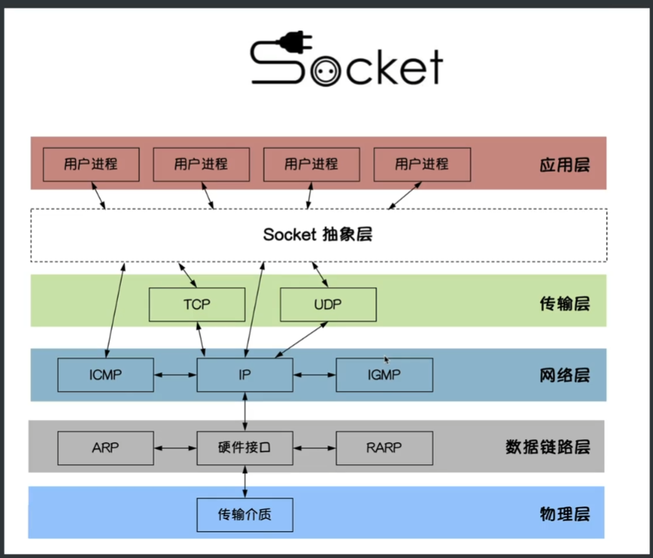
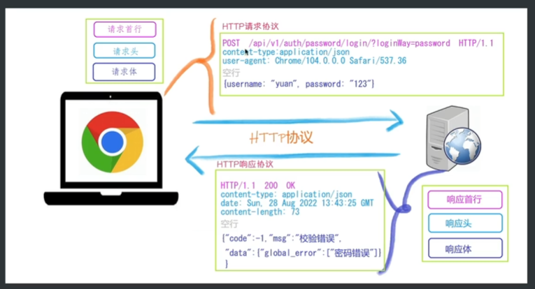
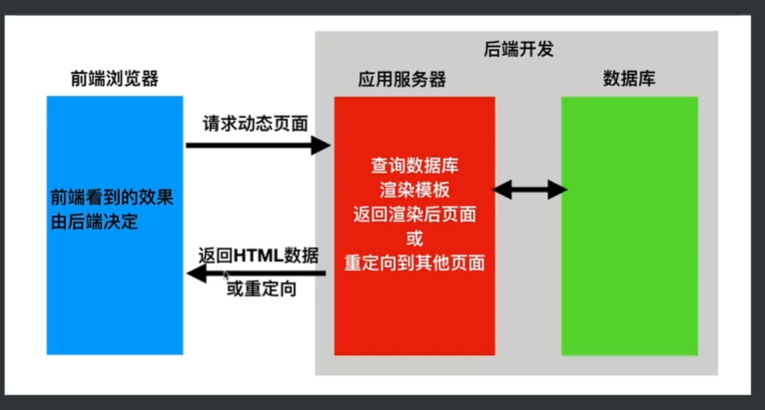
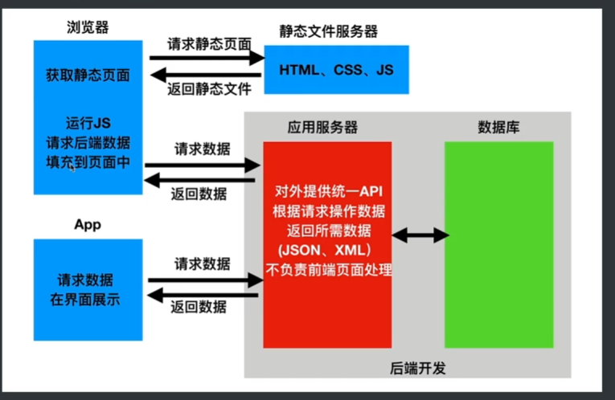
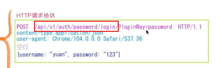
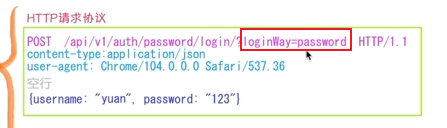

## http协议



socket：插座

1. socket涵盖了网络传输的底层操作，使用socket可以快速完成网络通信
2. 网络通信发送可以理解为字符串

客户端和服务器 发送的字符串需要遵守一定的协议，如http协议，如下图所示。

http协议一定是客户端先发送请求，服务段zai



get请求数据放在请求首行中，post请求的数据放在请求体中

### http请求协议首行

hhtp请求协议首行包含三个部分：请求方式（POST）、请求路径（api/v1/auth/password/login/?loginWay=password 路径+参数）、请求协议（HTTP/1.1）

### http请求协议请求头

每一个请求键值对独占一行，数量不固定。告诉服务器请求的基本信息

### http请求协议请求体

http请求协议请求头与http请求协议请求体之间使用空行分割，只有post请求数据会放在请求体中，get请求没有请求体，数据放在请求首行中，有长度限制，会被直接看到。

### content-type

约定服务端和客户段传递字符串的格式。

## 前后端

### 不分离

### 

前端看到效果由后端决定，后端直接返回html数据或者重定向页面

### 分离




## RESTful接口规范

RESTful接口规范（RESTful API Standards）是基于**REST（Representational State Transfer）架构**的一套接口设计规范，用于定义如何设计和实现网络服务接口。RESTful API通常用于**客户端与服务器之间的数据交互**，是许多现代Web服务的基础。RESTful接口规范旨在保持API的易读性、扩展性和一致性。以下是其主要概念和规范细节：

### 1. 资源（Resource）

在REST架构中，一切都是资源。资源可以是数据实体、文件、用户信息等。每个资源通过**URI（统一资源标识符）**来唯一标识。

- URI 示例：`https://api.example.com/users/123`
- 上述 URI 表示资源类型是 `users`，并指定用户 ID 为 `123`。

### 2. HTTP 方法

RESTful API 使用标准的 HTTP 方法来操作资源，不同的方法有不同的用途：

- **GET**：读取资源。例如，`GET /users/123` 获取用户ID为123的用户信息。
- **POST**：创建资源。例如，`POST /users` 向用户集合中添加一个新用户。
- **PUT**：更新资源（通常是整个资源）。例如，`PUT /users/123` 更新用户ID为123的所有信息。
- **PATCH**：部分更新资源。例如，`PATCH /users/123` 更新用户ID为123的某个字段。
- **DELETE**：删除资源。例如，`DELETE /users/123` 删除用户ID为123的用户。

### 3. 资源路径

资源路径应具有**直观性**和**一致性**，且应为**名词**，不要使用动词。

- 错误示例：`/getUser`、`/createUser`
- 正确示例：`/users`（用户集合）、`/users/{id}`（特定用户）

### 4. 使用版本控制

API 的版本控制可以通过在 URL 中指定版本号来实现，以便在更新 API 时不破坏现有客户端。

- 示例：`https://api.example.com/v1/users`

## web框架学习流程

1. 路由系统->逻辑函数(请求参数、响应方式)->数据库(ORM、模板引擎、中间件)

## 路径操作装饰器

## 请求与相应

### 路径参数

请求协议中？前的参数被称为路径参数



在 FastAPI 中，路径参数用于从请求的 URL 中提取数据。路径参数通常作为函数参数传递，并且是 URL 中的一部分。FastAPI 会自动验证和转换这些参数的类型。

```python
from fastapi import FastAPI

app = FastAPI()

@app.get("/users/{user_id}")
async def read_user(user_id: int):
    return {"user_id": user_id, "message": f"User with ID {user_id} found."}

@app.get("/items/{item_id}")
async def read_item(item_id: str):
    return {"item_id": item_id, "message": f"Item with ID {item_id} found."}

```

#### 路径参数的说明

1. **定义路径参数**：在 URL 路径中使用花括号 `{}` 包裹参数名。在上述示例中，`{user_id}` 和 `{item_id}` 是路径参数。
2. **类型提示**：在函数参数中使用类型提示（如 `int` 和 `str`），FastAPI 会自动验证请求中的路径参数，并将其转换为相应类型。

在 FastAPI 中，路由匹配的顺序是处理请求时的重要部分。了解这一点可以帮助你更好地设计 API，以确保路由的正确性和效率。以下是一些关键点：

#### 路由匹配顺序

1. **定义顺序**：FastAPI 按照路由定义的顺序进行匹配。也就是说，先定义的路由优先级高，如果请求路径与多个路由匹配，只有**第一个匹配的路由会被处理**。
2. **静态路由优先**：静态路由（例如 `@app.get("/users/")`）的匹配优先于动态路由（例如 `@app.get("/users/{user_id}")`）。因此，如果有一个静态路由和一个动态路由都与同一个请求匹配，静态路由将优先处理。
3. **路径参数优先**：如果有多个动态路由，FastAPI 会根据路径参数的匹配来确定顺序。例如，`@app.get("/items/{item_id}")` 会优先于 `@app.get("/items/{item_id}/details")`。
4. **HTTP 方法区分**：同一路由可以定义不同的 HTTP 方法，FastAPI 会根据请求的 HTTP 方法来匹配。例如，如果有 `GET /items/` 和 `POST /items/`，它们是不同的路由。
5. **通配符匹配**：当使用通配符（例如 `@app.get("/items/{item_id}/comments/{comment_id}")`）时，FastAPI 会先尝试匹配具体的路由，然后再匹配更通用的路由。

### 查询参数

请求协议？后的参数



在 FastAPI 中，查询参数用于在 URL 中传递数据，通常用于过滤、排序或其他与请求相关的选项。查询参数以键值对的形式出现在 URL 中，形式为 `?key1=value1&key2=value2`。

```python
from fastapi import FastAPI
from typing import Optional

app = FastAPI()

@app.get("/items/")
async def read_items(skip: Optional[int] = 0, limit: Optional[int] = 10):
    return {"skip": skip, "limit": limit, "items": ["item1", "item2", "item3"]}

@app.get("/users/")
async def read_users(age: Optional[int] = None, city: Optional[str] = None):
    return {
        "age": age,
        "city": city,
        "message": "User data retrieved successfully."
    }

```

在路径参数中没有声明的参数即为查询参数

#### 查询参数的说明

1. **定义查询参数**：在路由函数的参数中定义查询参数。可以使用 `Optional` 来指定参数是可选的。如果请求中没有该参数，FastAPI 会使用默认值（如果指定了的话）。
2. **默认值**：可以为查询参数指定默认值。例如，`skip` 的默认值为 `0`，`limit` 的默认值为 `10`。
3. **类型提示**：FastAPI 会根据参数的类型提示自动进行验证和转换。例如，如果 `age` 是 `int` 类型，FastAPI 会确保查询参数被解析为整数。

### 请求体数据

#### 请求体数据与查询参数

请求体数据和查询参数是两种用于传递信息的方式，在使用 FastAPI 或其他 Web 框架时，它们各有特点和适用场景。以下是它们之间的主要区别：

##### 1. 位置和格式

- 查询参数：
  - **位于 URL 中**，通常在路径之后，以 `?` 开始，多个参数用 `&` 分隔。
  - 格式通常为 `?key1=value1&key2=value2`，**一般用于简单的数据**。
- 请求体数据：
  - **位于 HTTP 请求的主体中**，通常在 POST、PUT、PATCH 等请求中发送。
  - 格式通常为 JSON 或其他数据格式（如 XML），适用于复杂的数据结构。

##### 2. 用途和语义

- **查询参数**：
  - 通常用于传递过滤、排序或分页等非敏感和简单的数据。
  - 适用于 GET 请求，方便在浏览器中直接查看和共享 URL。
- **请求体数据**：
  - 适用于**发送较复杂的数据结构**，例如创建或更新资源时的详细信息。
  - 常用于 POST、PUT 等请求，表示对服务器的修改或提交。

##### 3. 数据大小和复杂性

- **查询参数**：
  - 数据量有限，**通常不适合传递大量信息**。
  - 适合传递简单的数据，如字符串、数字、布尔值等。
- **请求体数据**：
  - **支持传递更大、更复杂的数据，如嵌套对象和数组**。
  - 更适合传递对象模型和复杂的数据结构。

##### 4. 验证和处理

- **查询参数**：
  - FastAPI 会自动进行类型转换和验证，适合基本类型。
  - 更适合简单的参数，如过滤条件、分页设置等。
- **请求体数据**：
  - 通过 Pydantic 模型进行详细的验证和解析，可以定义复杂的验证逻辑。
  - 支持更复杂的校验，如字段依赖、格式验证等。

##### 例子对比

###### 查询参数示例

```python
@app.get("/items/")
async def read_items(skip: int = 0, limit: int = 10):
    return {"skip": skip, "limit": limit}
```

```shell
curl -X 'GET' \
  'http://127.0.0.1:8010/api/v2/items/?skip=0&limit=10' \
  -H 'accept: application/json'
```

- URL: `GET /items/?skip=5&limit=10`

###### 请求体数据示例

```
class Item(BaseModel):
    name: str
    price: float

@app.post("/items/")
async def create_item(item: Item):
    return item
```

```shell
curl -X 'POST' \
  'http://127.0.0.1:8010/api/v3/items/' \
  -H 'accept: application/json' \
  -H 'Content-Type: application/json' \
  -d '{
  "name": "string",
  "price": 0,
}'
```

- 请求体：`{"name": "Sample Item", "price": 10.5}`

